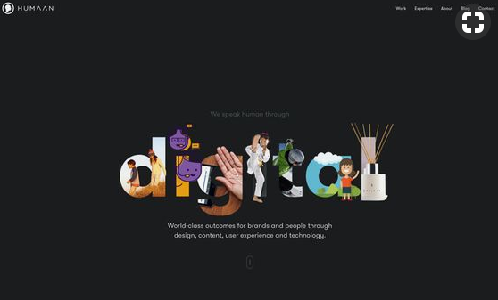
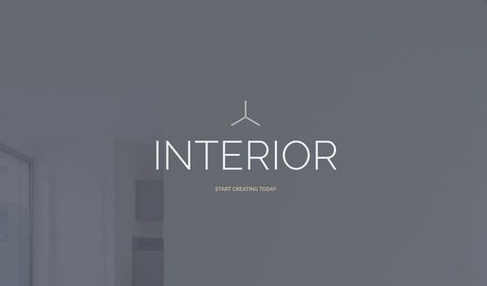
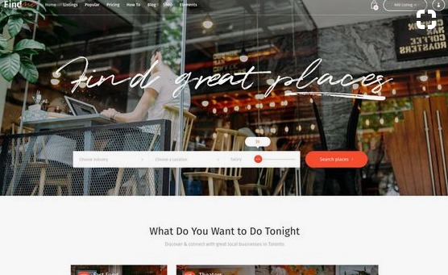
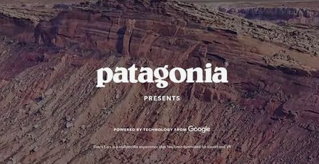
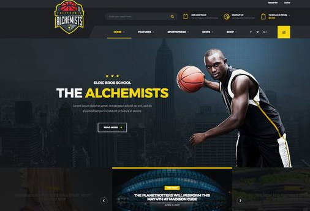
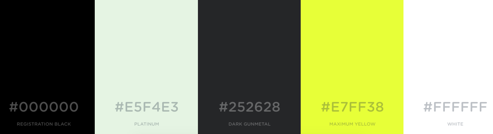
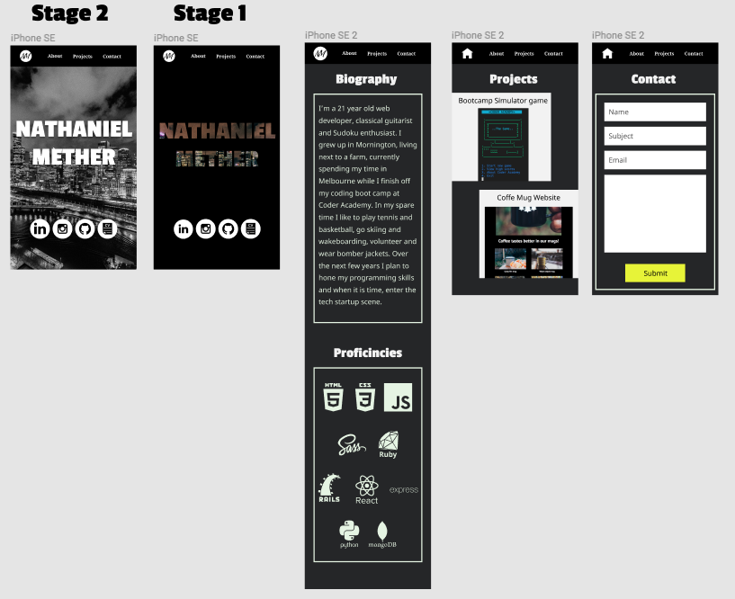

# Portfolio Website
*I am designing my portfolio website with the goal of having a clean, sleek design and to have a very readable and intuitive design.	I want to show to potential employers that I can follow every detail of a design.*
https://bricklayer-application-51711.netlify.com/

# Inspiration
https://au.pinterest.com/nmether/portfolio-website/

For this website I like how the design is quite dull except for the text which is the main content. I like the idea of using the text to create a cutout of an image underneath.

The minimal design for this website makes it look very clean.

The main text on this website would make a good contrast to an otherwise bland design that I’m planning for my website.

For this website I like the big bold white text on top of the background image, it would be good to use this for the main page.

I think the yellow in this website works very well is very clear on the otherwise dark color scheme.

# Style Guide

Fonts: 	
- Passion One in bold headings
- Noto Serif in bold for navbar links
- Noto Sans for page body content
- Aguafina Script for logo

Color Scheme:

# Wireframes
https://www.figma.com/file/BbP3ISDjDszkNL7CYTh6dxwU/Portfolio-website

For the main page I am planning to start with the black ground with the Melbourne picture behind it and then have it transition into the stage 2 image. After that I plan to have the image slowly regain its color to give viewers a break from the constant black and white.

For the biography and contact pages I decided to give the content a border to give it a more pleasant look.

I originally planned for the projects page to also have a border around the content but after trying that design I decided it would be much better to have the tiles touching the edges of the webpage.

For the all the pages I have made sure my design follows my color scheme while deviating from it only when I have images added.

For the navbar I decided to use a house logo to link back to the main page but decided that replacing it with a small logo would give a more unique feel to my website. I also spaced out all the elements in the navbar so it would be most aesthetically pleasing while also keeping the links far enough from each other that they could be clicked on without accidently pressing the wrong one.

# Challenges

-	Adding gray scale filter to background image on figma.
-	Using my text to crop the Melbourne image in figma.
-	Making the background image fit the page the way I had designed it.
-	Making the icons of all the programming languages the color I wanted them to be.
-	Spacing the icons the way I designed.
-	Floating div to right hand side on projects page was breaking the design of the elements inside the div.
- Changing proficincies section from mobile to tablet design - May need javascript.

# TODO

-	Fix text so it matches figma design exactly - Not possible for exact match
-	Add animation to the home page
-	Add hover animation for links to give responsiveness to website
-	Link up contact page with my email
- Give confirmation for sending email
- Add favicon
